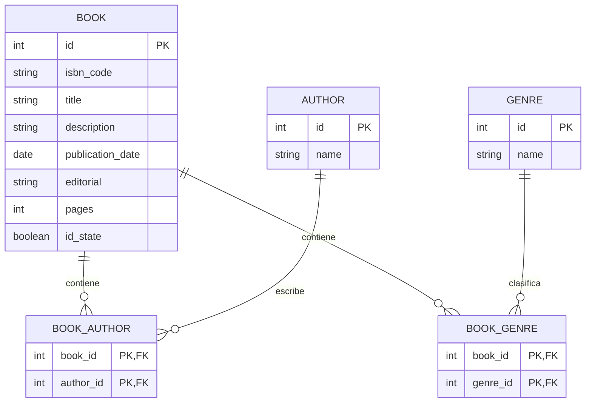

# 📚 Biblioteca Feminista - Sistema de Gestión

Bienvenidas al repositorio oficial del proyecto **Biblioteca Feminista**. Este proyecto nace con el objetivo de modernizar y digitalizar la gestión del inventario de la biblioteca de nuestro barrio, facilitando a la administradora el control total sobre los libros disponibles para prestar un mejor servicio a la comunidad.

---

## 🎯 Briefing y Objetivos del Proyecto

La biblioteca feminista ha crecido y necesita dejar atrás los registros manuales. Este software por terminal (CLI) proporciona un sistema robusto para añadir, borrar, ver y buscar libros mediante distintos atributos.

El proyecto está desarrollado aplicando metodologías ágiles, buenas prácticas de Programación Orientada a Objetos (POO) y principios de arquitectura de software para asegurar que el código sea escalable, mantenible y seguro.

---

## 💻 Tecnologías y Herramientas

| Tecnología | Versión | Propósito |
|---|---|---|
| Java | 25 | Lenguaje principal |
| PostgreSQL | 16.x | Base de datos relacional |
| Maven | 4.x | Gestor de dependencias |
| JDBC Nativo | — | Conexión a base de datos |
| Lombok | 1.18.46 | Reducción de código boilerplate |
| dotenv-java | 3.2.0 | Variables de entorno seguras |
| JUnit 5 + Mockito | — | Testing unitario |
| Git / GitHub | — | Control de versiones |

---

## 👩‍💻 Equipo de Desarrollo

| Nombre | Rol | GitHub |
|---|---|---|
| Maria Elena Almansa | Developer | [@elenaalmansacampos](https://github.com/elenaalmansacampos) |
| Johanna Monroy | Product Owner & Developer | [@Johamonroy20](https://github.com/Johamonroy20) |
| Nayeli Córdova Mendoza | Scrum Master & Developer | [@nagicome03](https://github.com/nagicome03) |
| Rukayatu Seidu | Developer | [@rseidu941-commits](https://github.com/rseidu941-commits) |
| Andrea Tapia | Developer | [@atapiamallea](https://github.com/atapiamallea) |

---

## 🏗️ Arquitectura y Patrones de Diseño

El código sigue una **arquitectura multicapa** con clara separación de responsabilidades:

```
┌─────────────────────────────────────────────┐
│                  App.java                    │  ← Punto de entrada
├─────────────────────────────────────────────┤
│          View (interfaz de usuario)          │  ← Menús con colores ANSI
├─────────────────────────────────────────────┤
│           Controller (lógica)                │  ← Capa intermedia
├─────────────────────────────────────────────┤
│        Repository (acceso a datos)           │  ← JDBC + PostgreSQL
├─────────────────────────────────────────────┤
│       Model (entidades del dominio)          │  ← Book, Author, Genre
└─────────────────────────────────────────────┘
```

### Patrones utilizados

1. **MVC (Modelo-Vista-Controlador):**
   - **Modelo:** `Book`, `Author`, `Genre`
   - **Vista:** `MainMenuView`, `ManageBooksView`, `SearchBooksView`
   - **Controlador:** `BookController`

2. **Patrón Repository:**
   - `BookRepository` (interfaz) → `BookRepositoryImpl` (implementación con JDBC)
   - Desacopla la lógica de negocio del acceso a datos

3. **Base de Datos Normalizada (3FN):**
   - Relaciones N:M gestionadas mediante tablas intermedias para múltiples autores y géneros por libro

---

## 📂 Estructura del Proyecto

```
src/main/java/com/
├── library/
│   ├── App.java                          ← Punto de entrada
│   ├── config/
│   │   ├── DBManager.java                ← Conexión a PostgreSQL
│   │   └── util/ConsoleColors.java       ← 25 constantes de color ANSI
│   ├── controller/
│   │   └── BookController.java           ← Capa intermedia
│   ├── model/
│   │   ├── Book.java                     ← @Data + @Builder (Lombok)
│   │   ├── Author.java
│   │   └── Genre.java
│   └── repository/
│       ├── BookRepository.java           ← Interfaz
│       └── BookRepositoryImpl.java       ← Implementación con JDBC
└── view/
    ├── MainMenuView.java                 ← Menú principal
    ├── ManageBooksView.java              ← CRUD (Ver, Añadir, Eliminar)
    └── SearchBooksView.java              ← Búsquedas
```

---

## ✅ Funcionalidades

| Opción | Descripción | Estado |
|---|---|---|
| Ver todos los libros | Lista completa con tarjetas visuales y colores | ✅ Implementado |
| Añadir libro | Formulario paso a paso con autores y géneros múltiples | ✅ Implementado |
| Eliminar libro | Por ID con borrado en cascada (book_author, book_genre, book) | ✅ Implementado |
| Buscar por título | Búsqueda parcial (LIKE) case-insensitive | ✅ Implementado |
| Buscar por autora | Búsqueda parcial por nombre de autora | ✅ Implementado |
| Buscar por género | Filtrado por género literario | ✅ Implementado |
| Editar libro | Modificar datos de un libro existente | ❌ Pendiente |

### Flujo de navegación

```
┌──────────────────────────────────────────────┐
│ 📚 BIBLIOTECA FEMINISTA DEL BARRIO 📚        │
│ Bienvenido de nuevo, Administradora          │
└──────────────────────────────────────────────┘
┌── MENÚ PRINCIPAL ────────────────────────────┐
│ [1] Gestionar libros  ► submenú             │
│ [2] Buscar libros     ► submenú             │
│ [0] Salir                                    │
└──────────────────────────────────────────────┘

┌── GESTIONAR LIBROS ──────────────────────────┐
│ [1] Ver todos los libros                     │
│ [2] Añadir nuevo libro                       │
│ [3] Eliminar libro                           │
│ [0] Volver                                   │
└──────────────────────────────────────────────┘

┌── BUSCAR LIBROS ─────────────────────────────┐
│ [1] Buscar por título                        │
│ [2] Buscar por autora                        │
│ [3] Buscar por género literario              │
│ [0] Volver                                   │
└──────────────────────────────────────────────┘
```

### Formato de tarjeta de libro

```
┌─────────────────────────────────────────────────┐
│ ID: 1 | El segundo sexo                         │
│ Autoras: Simone de Beauvoir                     │
│ Géneros: Ensayo, Feminismo                      │
│ ISBN: 978-84-306-1234-5 | Taurus | 350p | ✅ Sí │
└─────────────────────────────────────────────────┘
```

---

## 🗄️ Diagrama Entidad-Relación (Base de Datos Real)



---

## 🚀 Instalación y Despliegue

### 1. Prerrequisitos

- **Java Development Kit (JDK) 25**
- **PostgreSQL** (en ejecución)
- **Maven**

### 2. Configuración de la base de datos

Crea una base de datos en PostgreSQL:

```sql
CREATE DATABASE feminist_library;
```

Crea las tablas según el diagrama entidad-relación.

### 3. Configuración del entorno (`.env`)

Copia el archivo de ejemplo y ajústalo con tus credenciales:

```bash
cp .env.example .env
```

Edita `.env`:

```
DB_URL=jdbc:postgresql://localhost:5432/feminist_library
DB_USER=postgres
DB_PASS=tu_contraseña
```

> ⚠️ El archivo `.env` está en `.gitignore` — nunca se sube al repositorio.

### 4. Compilar y ejecutar

```bash
# Compilar
mvn clean compile

# Ejecutar
mvn exec:java -Dexec.mainClass="com.library.App"

# O bien generar JAR y ejecutar
mvn package
java -jar target/library-1.0-SNAPSHOT.jar
```

### 5. Ejecutar tests

```bash
mvn test
```

---

## ⚠️ Troubleshooting — Errores comunes

| Error | Causa | Solución |
|---|---|---|
| `Connection refused` | PostgreSQL no está corriendo | `brew services start postgresql` o `sudo systemctl start postgresql` |
| `password authentication failed` | Credenciales incorrectas en `.env` | Verifica `DB_USER` y `DB_PASS` |
| `relation "book" does not exist` | Base de datos vacía | Crea las tablas del diagrama ER |
| `Key (book_id)=(0)` | `RETURN_GENERATED_KEYS` faltante | Usa `prepareStatement(sql, RETURN_GENERATED_KEYS)` |

---

## 🧪 Testing

El proyecto incluye tests unitarios con **JUnit 5** y **Mockito**:

```bash
# Ejecutar todos los tests
mvn test

# Ejecutar un test específico
mvn test -Dtest=BookControllerTest
```

---

## 🌱 Próximos pasos

- [ ] Implementar edición de libros (`updateBook`)
- [ ] Añadir filtros combinados (título + autora + género)
- [ ] Interfaz web (Spring Boot + Thymeleaf)
- [ ] Sistema de préstamos y devoluciones
- [ ] Autenticación de administradoras

---

## 📄 Licencia

Este proyecto es de código abierto para fines educativos y comunitarios.

---

Hecho con ❤️ por el equipo **Biblioteca Feminista**
