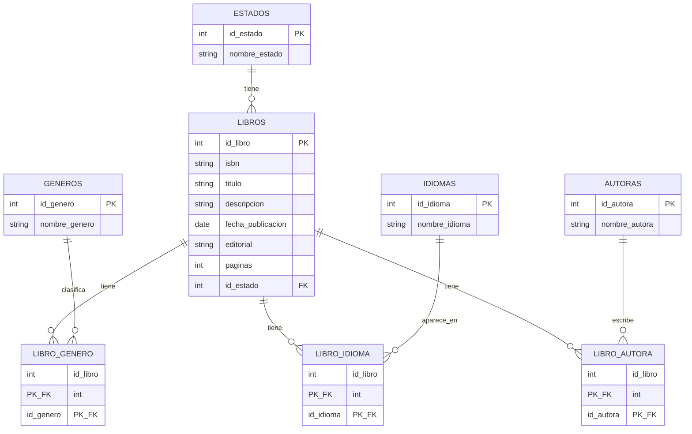

# 📚 Biblioteca Feminista - Sistema de Gestión

Bienvenidas al repositorio oficial del proyecto **Biblioteca Feminista**. Este proyecto nace con el objetivo de modernizar y digitalizar la gestión del inventario de la biblioteca de nuestro barrio, facilitando a la administradora el control total sobre los libros disponibles para prestar un mejor servicio a la comunidad.

---

## 🎯 Briefing y Objetivos del Proyecto

La biblioteca feminista ha crecido y necesita dejar atrás los registros manuales. Este software por terminal (CLI) proporciona un sistema robusto para añadir, actualizar, borrar, ver y buscar libros mediante distintos atributos. 

El proyecto está desarrollado aplicando metodologías ágiles, buenas prácticas de Programación Orientada a Objetos (POO) y principios de arquitectura de software para asegurar que el código sea escalable, mantenible y seguro.

---

## 💻 Tecnologías y Herramientas

El proyecto está construido utilizando las siguientes tecnologías y herramientas con sus respectivas versiones:

* **Lenguaje:** Java 25 (Vanilla)
* **Base de Datos:** PostgreSQL (Relacional)
* **Gestor de Dependencias:** Maven
* **Testing:** JUnit 5 y Mockito
* **Conexión a Datos:** JDBC Nativo
* **Control de Versiones:** Git y GitHub
* **Gestión de Tareas:** Jira / Trello
* **IDEs Recomendados:** Visual Studio Code / IntelliJ IDEA

---
## Equipo de Desarrollo

| Name | Role | GitHub |
|------|------|--------|
| Maria Elena Almansa  | Developer | [@elenaalmansacampos](https://github.com/elenaalmansacampos) |
| Johanna Monroy | Product Owner & Developer | [@Johamonroy20](https://github.com/Kressala) |
| Nayeli Córdova Mendoza| Scrum Master - Developer | [@nagicome03](https://github.com/IvannaRCA) |
| Rukayatu Seidu | Developer | [@rseidu941-commits](https://github.com/rseidu941-commits) |
|  Andrea Tapia | Developer | [@atapiamallea](https://github.com/orgs/Biblioteca-feminista-Team-2/people/atapiamallea) |

---

## 🏗️ Arquitectura y Patrones de Diseño

El código está estructurado bajo principios de separación de responsabilidades:

1. **Arquitectura MVC (Modelo-Vista-Controlador):** 
   * **Modelo:** Gestión de entidades y DTOs.
   * **Vista:** Interfaz interactiva por terminal (`ConsoleView`).
   * **Controlador:** Orquestación y lógica de negocio.
2. **Patrón Repository:** Desacopla la lógica de negocio del acceso a la base de datos PostgreSQL, facilitando el mantenimiento y las pruebas unitarias.
3. **Base de Datos Normalizada (3FN):** Relaciones $N:M$ gestionadas mediante tablas intermedias para soportar múltiples autores y géneros literarios por cada libro.


## 🚀 Instalación y Despliegue

Sigue estos pasos para ejecutar el proyecto en tu entorno local:

### 1. Prerrequisitos
* Tener instalado **Java Development Kit (JDK) 25**.
* Tener instalado y en ejecución **PostgreSQL**.
* Tener instalado **Maven**.

### 🛠️ Configuración del Entorno (`.env`)

Este proyecto utiliza variables de entorno para gestionar las credenciales de la base de datos de forma segura. El archivo `.env` real está excluido del control de versiones (`.gitignore`), por lo que deberás crear el tuyo propio localmente.

### Pasos para la configuración:

1. **Copiar el archivo de ejemplo:**
   En la raíz del proyecto duplica el archivo `.env.example` y renómbralo como `.env`:
```bash
   cp .env.example .env

   DB_URL=jdbc:postgresql://localhost:5432/tu_nombre_de_base_de_datos
   DB_USER=tu_usuario_postgres
   DB_PASS=tu_contraseña_segura
```

## Diagrama entidad-relación


